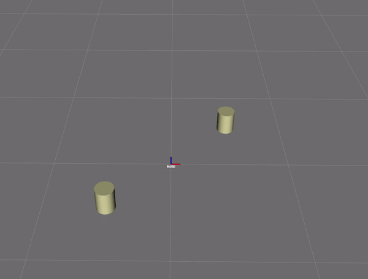
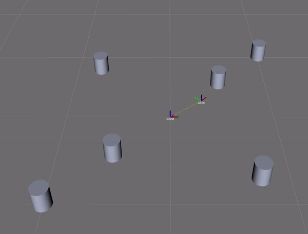

# Nuturtlesim
This package contains a simulator for the turtlebot and its landmark-filled environment (tubes). This simulator simulates the kinematics of the robot and a sensor that detects the relative (x,y) positions of landmarks and their ids.

## Overview
The package contains the following nodes:
* `tube_world` - this node simulates the turtlebot's environment and the sensors used to detect landmarks. It tracks the ground truth location of the robot, maintains the positions of obstacles (landmarks and walls), detects collisions between the robot and the landmarks, and simulates a laser scanner using a point cloud.

The `tube_world` node maintains the ground truth positions of the obstacles relative to the `world` frame as shown below,


The node also maintains the positions of the obstacles relative to the turtlebot's location. The node calculates the distance between the turtlebot and the obstacle, and if it is within a certain range, then the landmark is visible. Otherwise, the landmark is no longer visible. See below in a small snippet where the turtlebot explores the environment,



The node models the turtlebot and the obstacles as having a circle footprint. If these footprints collide with each other (meaning that the robot collides with an obstacle), then the turtlebot slips in the direction of the line tangent between the robot and the obstacle as seen below,



## Example Usage
Open a terminal and run the following command
```
roslaunch nuturtlesim tube_world.launch
```
This will open a simulation in which the robot is surrounded by tubes and four walls. Based on these markers, the simulation will send out LaserScan messages, which can be used in the ``` nuslam``` package.